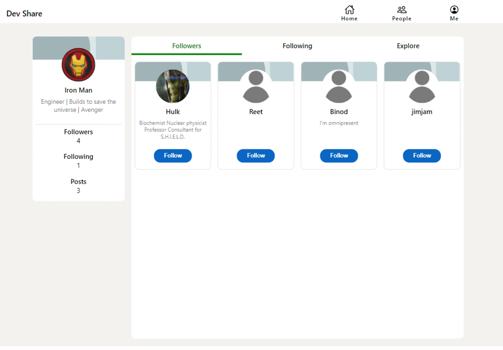

# Dev Share

A social media application built for devs. Having a UI similar to Linkedin, it will help users have a very low learning curve to adapt.

### Features

- Landing page with feeds from people you follow
- Profile Stats and follow suggestions on the Homepage
- Ability to add posts with images, comments and likes
- Connection page to manage your followers and following
- Visit any profile
- View and edit your own profile.

### Tech Stack

- React
- Redux Toolkit
- Typescript
- Express
- Mongo

### Reflection

One of the interesting projects that I worked on. Data modelling played a crutial part in designing the application. I learnt that distributed data models is important when dealing with complex data relations.

Redux Tookit especially comes in very handy when we talking scenarios where we have a complex component tree. Typescript helped in bringing in data integrity just by adding types to all states. Working on this helped me think of different data structures that I could utilize for reusable but complex structures like comments and comment replies. Redux thunk made it easy to integrate services along with dispatches and also providing out of the box network status. This enabled to make optimistic client updates much simpler. Not to forget the visualization available on the Redux Dev toolkit which helps the redux data flow.

Redux tooklit has lot of featues to utilized which is still unexplored by me. Also looking forward to see what else is available in the redux ecosystem that fits into my requirements.

### Upcoming Features

- Ability to add code to posts
- live chat between mutual friends
- Appect / Reject connections
- Save posts

### Installation & Usage

Clone down this repository. You will need `node` and `npm` installed globally on your machine.

`npm install`

To Start Server:

`npm start`

To Visit App:

`localhost:3000`
